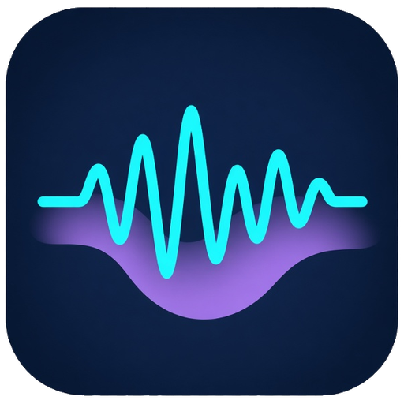
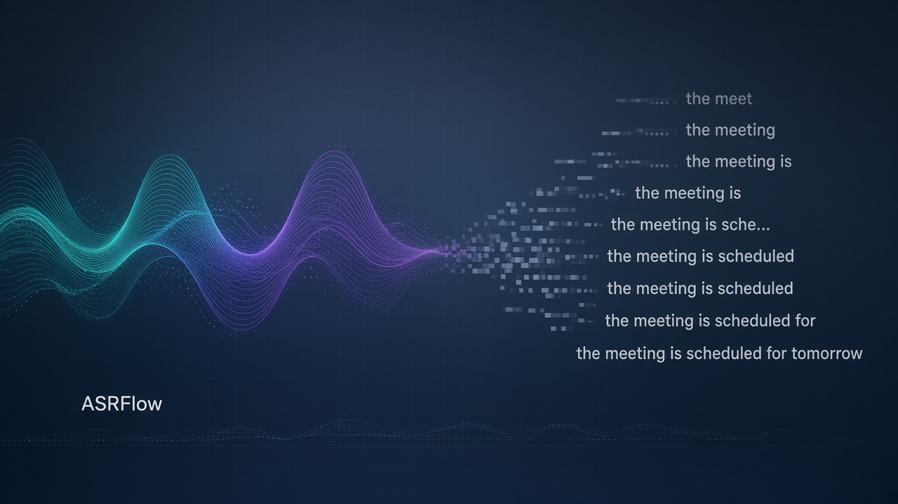
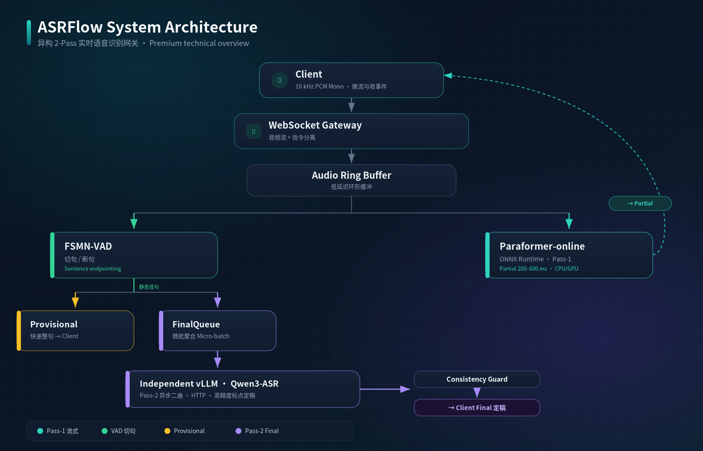

<div align="center">
  
  <h1>ASRFlow</h1>
  <p><b>异构 2-Pass 实时语音识别网关</b></p>
  <p><i>低延迟流式首遍 + 高精度异步二遍</i></p>

  <p>
    <a href="https://github.com/zyf8827/asrflow/blob/main/LICENSE"></a>
    <a href="https://github.com/zyf8827/asrflow/actions/workflows/ci.yml"></a>
    <a href="https://www.python.org"></a>
    <a href="https://zyf8827.github.io/asrflow-website/"></a>
  </p>

  <p>
    
  </p>
</div>

---

ASRFlow 是一个异构两阶段（2-Pass）实时语音识别网关。客户端通过单个 WebSocket 长连接持续推送 16kHz PCM 音频流并接收识别事件。网关将识别流水线划分为两遍：首遍（Pass-1）基于 ONNX Runtime 运行流式 Paraformer-online，输出 200~600ms 低延迟中间字（`partial`）并在 VAD 断句时产出快速整句（`provisional`）；二遍（Pass-2）在断句后异步调用独立部署的 Qwen3-ASR vLLM 服务，输出带标点的高精度定稿文本（`final`）。

在长时间流式会话中，流式模型常面临近零静音或底噪环境下的偶发孤立 Token 吐字、时间戳漂移以及下游重复拼接退化等问题。ASRFlow 通过分层退化防护（近零静音过滤、VAD 状态门控、超时看门狗及二遍一致性校验），在保持低延迟交互体验的同时，拦截异常字符积累。

服务采用解耦架构：网关自身不绑定重型推理框架，通过 HTTP 接口与独立部署的 vLLM 通信；首遍引擎支持多路并发动态合批，内置断线重连（`resume` 会话缓存）、动态热词偏置、说话人识别与逆文本正则化（ITN）。

---

## 核心特性

- **异构 2-Pass 流水线**：首遍 Paraformer-online（ONNX Runtime）提供 200~600ms 快速反馈（`partial` / `provisional`），二遍异步调用独立 Qwen3-ASR（vLLM）输出高精度标点定稿（`final`）。
- **首遍动态多路合批**：流式引擎支持多路并发连接在动态时间窗口内组批推理（[`core/streaming_asr/onnx_batched_streaming.py`](core/streaming_asr/onnx_batched_streaming.py)），兼顾吞吐与低时延。
- **分层流式防退化检查**：
  - **L0**：非语音态下对近零静音（<-80 dBFS）过滤偶发 Token（[`core/audio_energy.py`](core/audio_energy.py)）；
  - **L1**：VAD 未起段时抑制 Partial 发送并锁存起始时间戳，防止时间轴漂移（[`pipeline/session_pipeline.py`](pipeline/session_pipeline.py)）；
  - **L2**：非语音累积超时看门狗切段送二遍裁决，配合 Consistency Guard 校验防幻觉（详见 [流式输出退化分层防护设计](docs/design_degenerate_rows_guard_2026-09-18.md)）。
- **架构解耦设计**：二遍模型通过 HTTP 接口调用独立部署的 vLLM 进程，网关依赖轻量（vLLM 不进服务依赖）。
- **会话管理与掉线恢复**：支持基于 `session_id` 的客户端断线重连与状态恢复（`resume` 会话缓存机制）；支持客户端主动发送 `commit` 信令强制切句。
- **辅助能力与服务发现**：支持动态热词（Hotwords）偏置、说话人识别与聚类（CAM++ / ERes2NetV2）、逆文本正则化（ITN）；支持可选的 Nacos 实例自动注册与心跳保活。
- **服务观测与健康检查**：内置 HTTP `/healthz`、`/ready` 健康探针与 Prometheus `/metrics` 指标。

---

## 架构概览

<div align="center">
  
</div>

---

## 快速开始

### 1. 本地直接运行

依赖准备：Python ≥ 3.10，CUDA/GPU 环境（首遍推荐 ONNX Runtime，二遍推荐 vLLM）。

```bash
# 克隆仓库
git clone https://github.com/zyf8827/asrflow.git
cd asrflow

# 安装完整依赖
pip install -r requirements.txt

# 下载 FunASR 基础模型（Paraformer、VAD、Speaker、Punc）
python3 scripts/download_models.py --only_funasr

# 导出首遍 ONNX 计算图（产出至 models/onnx/）
python3 scripts/export_onnx.py
```

启动独立 Qwen3-ASR 服务（vLLM，建议运行于 GPU 节点）：

```bash
vllm serve Qwen/Qwen3-ASR-1.7B \
  --served-model-name qwen3-asr \
  --host 0.0.0.0 \
  --port 8899 \
  --max-model-len 4096 \
  --dtype bfloat16
```

启动 ASRFlow 网关：

```bash
python3 main.py \
  --port 10095 \
  --http_port 10096 \
  --vllm_url http://127.0.0.1:8899/v1/audio/transcriptions \
  --final_model qwen3-asr \
  --streaming_backend onnx \
  --vad_backend funasr \
  --speaker_backend funasr \
  --final_backend vllm_http
```

在另一个终端使用内置控制台客户端推流测试：

```bash
python3 demo/console_client.py \
  --uri ws://127.0.0.1:10095 \
  --audio fixtures/sample_16k.wav \
  --full
```

### 2. Docker Compose 运行

网关与 vLLM 独立容器编排、多架构支持（CPU / NVIDIA GPU / 华为昇腾 NPU）及单/多实例配置见 [`deployment/`](deployment/) 目录：

```bash
# 生成配置文件（.env 与 docker-compose.yaml）
bash deployment/init-compose.sh

# 启动容器
docker compose -f deployment/docker-compose.yaml up -d
```

> **开发者测试**：代码仓库自带单元测试与 E2E 测试套件，使用进程内测试替身（fake / mock）验证协议与流水线逻辑（详见 [CONTRIBUTING.md](CONTRIBUTING.md)）：
> ```bash
> PYTHONPATH=. python3 -m unittest discover -s tests -v
> ```

---

## 客户端接入与协议要点

客户端只需维持单个 WebSocket 连接即可完成推流与信令交互。

### 1. 连接端点与音频规格

- **WebSocket 服务**：`ws://<host>:10095`（音频流与信令同连接，按帧类型严格区分）
- **HTTP 运维端口**：`http://<host>:10096`（`/healthz`、`/ready`、`/metrics`）
- **音频格式要求**：
  - 编码：**PCM16**（有符号 16 位小端原始字节，无 WAV 头）
  - 采样率：**16000 Hz**，**单声道**
  - 传输方式：**Binary 帧**（推荐每帧 60ms = 1920 字节，按实时节奏持续发送）

### 2. 控制信令（Text 帧）

所有控制信令均为 JSON 格式的 Text 帧：

- **`start`**：握手与会话初始化，可携带 `session_id`（用于断线重连）、`hotwords` 热词偏置列表、说话人识别开关等；
- **`commit`**：客户端主动提交当前未成句音频（用于静音键按下、前端切句或人工截断）；
- **`stop`**：音频推流完毕，等待所有句段最终定稿。

### 3. 下行识别事件

网关向下游客户端推送四类消息：

| 消息类型 | 触发时机 | 说明 |
| :--- | :--- | :--- |
| `partial` | 首遍流式识别中（200~600ms） | 增量未决文本，低时延高频刷新 |
| `provisional` | VAD 检测到静音断句时 | 首遍产出的快速整句 |
| `final` | 二遍 Qwen3-ASR 异步推理完成后 | 高精度定稿文本，带标点与说话人标识 |
| `error` | 参数非法或服务端异常 | 错误说明与状态码 |

> [!NOTE]
> 默认 WebSocket 网关不设鉴权，对外提供服务时请部署于私有网络内或在反向代理（如 Nginx）层配置鉴权与速率限制，详见 [SECURITY.md](SECURITY.md)。
>
> 完整字段定义、时序状态机、掉线恢复机制与 Python/JS 客户端接入示例见 [客户端接入指南 (docs/client-integration-guide.md)](docs/client-integration-guide.md)。

---

## 常用配置

配置优先级：`config/config.default.yaml` < 环境变量 < `main.py` CLI 参数。

| 配置项 | 环境变量 | 默认值 | 说明 |
| :--- | :--- | :--- | :--- |
| `server.port` | `ASR_SERVER_PORT` | `10095` | WebSocket 网关监听端口 |
| `server.http_port` | `ASR_HTTP_PORT` | `10096` | 运维 HTTP 端口（`/healthz`、`/ready`、`/metrics`） |
| `final_asr.vllm_url` | `VLLM_URL` | `http://127.0.0.1:8899/v1/audio/transcriptions` | 独立 Qwen3-ASR 在线服务地址 |
| `final_asr.model_name` | `FINAL_ASR_MODEL` | `qwen3-asr-1.7b` | 二遍模型名称（需对齐 vLLM `--served-model-name`） |
| `streaming_asr.backend` | `STREAMING_BACKEND` | `auto` | 首遍引擎：`onnx`、`mock` 或 `auto` |
| `streaming_asr.device` | `ASR_DEVICE` | `auto` | 首遍推理设备：可选 `cpu` 或 `cuda:0`（自动映射 ONNX Execution Provider） |
| `voice.watchdog_enable` | `VOICE_WATCHDOG_ENABLE` | `true` | 是否启用超时看门狗分段防护 |
| `server.resume_ttl_sec` | `RESUME_TTL_SEC` | `60.0` | 掉线会话保留时长（秒，0 表示禁用） |

---

## 仓库结构

```text
asrflow/
├── core/             # 核心组件实现
│   ├── streaming_asr/ # 首遍流式引擎（ONNX 多路合批）
│   ├── final_asr/     # 二遍异步引擎（vLLM HTTP / OpenAI）与微批队列
│   ├── vad/           # VAD 引擎（FSMN-VAD）
│   ├── speaker/       # 说话人识别与聚类（CAM++ / ERes2NetV2）
│   ├── guard/         # 防退化与一致性校验守卫（ConsistencyGuard）
│   ├── hotword/       # 动态热词偏置提取
│   ├── itn/           # 逆文本正则化
│   ├── session.py     # 会话状态机与上下文
│   └── ring_buffer.py # 音频环形缓冲区
├── pipeline/          # 单会话处理链编排（SessionPipeline）
├── server/            # 服务网关
│   ├── websocket_server.py # WebSocket 接入与信令/音频分发
│   ├── http_server.py      # HTTP 探针（/healthz, /ready, /metrics）
│   └── service.py          # 顶层服务生命周期编排
├── config/            # 配置文件与默认配置（config.default.yaml）
├── demo/              # 客户端 Demo（控制台推流、交互客户端）
├── deployment/        # Docker 构建与 Compose 编排脚本（CPU / GPU / 昇腾 NPU）
├── fixtures/          # 测试音频样本（sample_16k.wav）
├── scripts/           # 模型下载、ONNX 导出与维护脚本
├── tests/             # 单元与 E2E 测试套件
├── docs/              # 接入指南、防退化设计与技术文档
├── AGENTS.md          # 开发者与 Agent 协作指南
└── main.py            # 服务启动入口与 CLI 参数解析
```

---

## 文档索引

- [客户端接入与 WebSocket 协议指南 (docs/client-integration-guide.md)](docs/client-integration-guide.md)
- [流式输出退化分层防护设计 (docs/design_degenerate_rows_guard_2026-09-18.md)](docs/design_degenerate_rows_guard_2026-09-18.md)
- [首遍吞吐与压测基准报告 (docs/benchmark_report_pass1_all_versions_2026-09-04.md)](docs/benchmark_report_pass1_all_versions_2026-09-04.md)
- [Docker 容器化部署指南 (deployment/)](deployment/)
- [Agent 协作指南 (AGENTS.md)](AGENTS.md)
- [客户端 Demo 说明 (demo/README.md)](demo/README.md)
- [基准测试工具 (benchmark/README.md)](benchmark/README.md)
- [安全说明 (SECURITY.md)](SECURITY.md)
- [贡献指南 (CONTRIBUTING.md)](CONTRIBUTING.md)

---

## 许可证

本项目基于 [Apache-2.0](LICENSE) 许可证开源。模型权重由用户自行按对应协议从开源社区获取，详见 [NOTICE](NOTICE)。
